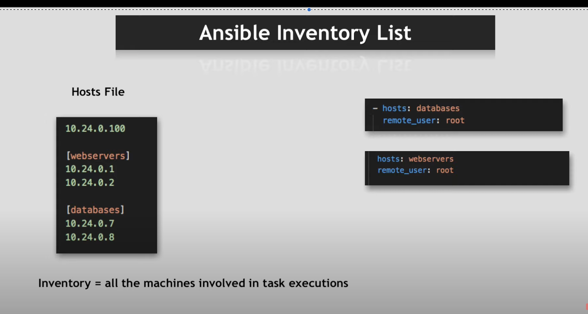

Ansible is an open-source IT automation tool used for:

IT Tasks-Upadates,Backup
 example if multiple servers running u need to ssh insto each of them manually and then make changes instead with ansible you can do that from you own machine by giving permission

1.Repative Tasks
2.Upgrade

Configuration Management → making sure servers, services, and software are set up the same way everywhere.

Application Deployment → installing and updating apps consistently across many machines.

Orchestration → managing the order in which systems, services, or tasks run.

Provisioning → spinning up infrastructure (servers, cloud resources) from scratch.

🔹 Key points about Ansible
Agentless
Unlike Puppet or Chef, it doesn’t require installing an agent on target machines — it uses SSH (or WinRM for Windows).

like just give ssh permission to your machine

Written in YAML
Automation tasks are described in simple YAML files called playbooks, making it human-readable.

Cross-platform
Works on Linux, Windows, cloud platforms (AWS, Azure, GCP), containers, and more.

Idempotent
If you run the same playbook twice, the end state will be the same — no accidental duplication.

| Feature            | Ansible                            | Terraform                   |
| ------------------ | ---------------------------------- | --------------------------- |
| **Main Purpose**   | Config management & app deployment | Infrastructure provisioning |
| **State Tracking** | No built-in persistent state       | Maintains state file        |
| **Language**       | YAML                               | HCL                         |
| **Agent**          | Agentless                          | Agentless                   |
| **Provisioning**   | Yes (via cloud modules)            | Yes                         |
| **Configuration**  | Yes                                | Limited                     |

1. Main Purpose — Ansible

Ansible is mainly for configuration management and application deployment.

Think of it like: your servers (VMs, containers, etc.) already exist, but you need to install software, configure settings, deploy apps, manage files, run scripts, and keep them in the desired state.

Example:

Install Nginx and configure it on 10 servers.

Deploy your app code from GitHub to those servers.

Update config files when requirements change.

2. Main Purpose — Terraform

Terraform is mainly for infrastructure provisioning.

Think of it like: you create the servers, networks, databases, load balancers, etc. in the first place — before Ansible even touches them.

Example:

Create 3 EC2 instances in AWS.

Create an RDS database and a VPC with subnets.

Set up load balancers and security groups.

💡 How they work together:

Terraform: "Let’s build the house" 🏠 (creates infrastructure).

Ansible: "Let’s furnish and arrange the house" 🛋️ (configures and deploys applications).

Module-get pushed to target server do their work and get removed 

I explain HOW Ansible does all this by going through its architecture:
 👉🏼 Ansible Modules (small programs that get executed on target machines)
 👉🏼 Ansible Playbook (instructions on HOW these programs get executed)
 👉🏼 Ansible Inventory (list of hosts, WHERE those programs gets executed)

---
- name: Install Nginx on servers
  hosts: webservers
  become: yes
  tasks:
    - name: Install Nginx
      apt:
        name: nginx
        state: present

hosts → target group of machines

become → run as sudo

tasks → the actions to perform

ansible-playbook install-nginx.yml

1. Ansible Modules 🧩 (“What gets done”)
Definition: Small programs that perform specific tasks on the target machine.

Purpose: They’re the building blocks — each module does one type of job.

Examples:

yum or apt → install packages.

copy → copy files from control node to target.

service → start/stop/restart a service.

user → create or remove users.

Analogy: Like kitchen appliances — each does a specific job (blender blends, toaster toasts).

2. Ansible Playbook 📜 (“How it gets done”)
Definition: A YAML file that defines a sequence of tasks using modules.

Purpose: It describes step-by-step instructions for Ansible to follow.

Example:

yaml
Copy
Edit
- hosts: webservers
  tasks:
    - name: Install Nginx
      apt:
        name: nginx
        state: present
    - name: Start Nginx
      service:
        name: nginx
        state: started
Analogy: Like a recipe — tells the chef (Ansible) exactly what steps to follow.

3. Ansible Inventory 📋 (“Where it gets done”)
Definition: A file (or dynamic source) listing the target machines.

Purpose: Defines which servers will get the tasks from the playbook.

Example (inventory file):

csharp
Copy
Edit
[webservers]
server1.example.com
server2.example.com

[dbservers]
db1.example.com
Analogy: Like an address book — tells Ansible where to go to run the tasks.

✅ Putting it together:

Modules → “Install Nginx” action.

Playbook → “First install Nginx, then start it” instructions.

Inventory → “Run these steps on webservers server1 and server2.”

If you already have:

Inventory file → inventory.ini

Playbook file → playbook.yml

Then the Ansible command to run it is:

bash
Copy
Edit
ansible-playbook -i inventory.ini playbook.yml
Explanation:

ansible-playbook → runs a playbook.

-i inventory.ini → tells Ansible which inventory file to use.

playbook.yml → the instructions to execute.

Exactly — if your Ansible inventory has the EC2 instance’s public IP or DNS name, and you run Ansible from your WSL, the connection happens over SSH.

Here’s how it works step-by-step:

1️⃣ Inventory file example (inventory.ini)
ini

[webservers]
ec2-3-111-45-67.ap-south-1.compute.amazonaws.com ansible_user=ubuntu ansible_ssh_private_key_file=~/.ssh/my-ec2-key.pem
[webservers] → group name for these hosts.

ansible_user=ubuntu → the Linux username on the EC2 instance (for Ubuntu AMIs it’s usually ubuntu; for Amazon Linux it’s ec2-user).

ansible_ssh_private_key_file → path to your .pem key file used for SSH authentication.

2️⃣ Running the playbook from WSL

ansible-playbook -i inventory.ini playbook.yml

